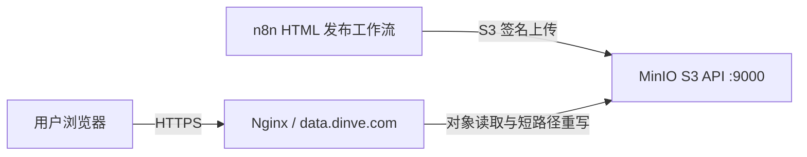

# Amazon 竞品分析 HTML 报告：MinIO 与 Nginx 运维配置

## 1. 文档目的

本文档用于指导开发运维完成 Amazon 竞品分析 HTML 报告的 MinIO 对象访问权限和 Nginx 短路径配置。

完成后应实现：

- n8n 可以继续通过 S3 Credential 向 MinIO 上传 HTML、CSS、JSON 和图片。
- 浏览器可以匿名读取 HTML 报告、CSS 和报告图片。
- 匿名用户不能上传、覆盖或删除 MinIO 对象。
- 标准 MinIO 对象 URL 可以正常访问。
- 用户可以通过不包含 bucket 名的短 URL 访问报告。
- MinIO bucket 中与页面渲染无关的结构化 JSON 可以继续保持私有。

## 2. 当前配置和已知问题

### 2.1 MinIO 与报告参数

| 配置项 | 当前值 |
|---|---|
| 公网域名 | `https://data.dinve.com` |
| Bucket | `amazon-reports` |
| 业务前缀 | `amazon/competitor-analysis` |
| n8n Credential 名称 | `MinIO S3 - Amazon Reports` |
| n8n Credential ID | `Ssmp3PXE3qSUYB6m` |
| 短链接开关默认值 | `htmlUseShortUrl: true`（MinIO/Nginx 于 2026-07-15 验收后启用） |

Credential ID 不是密钥，可以保存在工作流定义中。Access Key 和 Secret Key 必须继续保存在 n8n Credential 系统中，不得写入工作流 JSON、Git 仓库或本文档。

### 2.2 当前对象结构

```text
amazon-reports/
└── amazon/
    └── competitor-analysis/
        ├── _assets/
        │   └── css/
        │       └── report-v1.css
        └── {ownAsin}/
            ├── index.html
            └── runs/
                └── {runId}/
                    ├── index.html
                    ├── manifest.json
                    ├── report-data.json
                    └── assets/
                        └── images/
```

### 2.3 当前 URL

标准对象 URL：

```text
https://data.dinve.com/amazon-reports/amazon/competitor-analysis/{ownAsin}/index.html
```

预期短 URL：

```text
https://data.dinve.com/amazon/competitor-analysis/{ownAsin}/
```

归档报告短 URL：

```text
https://data.dinve.com/amazon/competitor-analysis/{ownAsin}/runs/{runId}/
```

在运维变更前，标准对象 URL 和短 URL 均返回 `HTTP 403 Forbidden`。2026-07-15 完成运维配置后，标准 HTML、短 URL、归档 URL、CSS 和实际报告图片均已验证返回 `200`；`manifest.json` 和 `report-data.json` 保持匿名 `403`。

## 3. 推荐网络架构



如果 n8n 和 MinIO 位于同一个 Docker Network，推荐让 n8n 使用内部地址上传：

```text
http://minio:9000
```

公网域名 `https://data.dinve.com` 仅负责浏览器访问。这样可以在 Nginx 公网入口进一步限制只允许 `GET` 和 `HEAD`。

如果当前 n8n Credential 已经使用 `https://data.dinve.com` 且上传正常，可以暂时保持不变，但 Nginx 必须继续转发经过 S3 签名的 `PUT`、`POST`、`HEAD` 和 multipart 请求。

## 4. MinIO 配置

### 4.1 配置原则

必须遵守：

- 只授予匿名 `s3:GetObject`。
- 不授予匿名 `s3:PutObject`。
- 不授予匿名 `s3:DeleteObject`。
- 不授予匿名 `s3:ListBucket`。
- 不把整个 MinIO 实例或整个 `amazon-reports` bucket 设为公开读写。
- 修改匿名策略前必须备份现有策略。

### 4.2 配置 MinIO Client

在具有 MinIO 管理权限且已安装 `mc` 的服务器上执行：

```bash
mc alias set dinve-minio https://data.dinve.com ACCESS_KEY SECRET_KEY
```

不要把真实 Access Key 和 Secret Key 保存到脚本、工单或 Git 仓库。建议通过安全的环境变量或密码管理工具提供。

如果 Nginx 尚未完成配置，也可以使用 MinIO 内网管理地址：

```bash
mc alias set dinve-minio http://127.0.0.1:9000 ACCESS_KEY SECRET_KEY
```

Docker 网络示例：

```bash
mc alias set dinve-minio http://minio:9000 ACCESS_KEY SECRET_KEY
```

### 4.3 检查 bucket 和对象

```bash
mc ls dinve-minio/amazon-reports
mc ls dinve-minio/amazon-reports/amazon/competitor-analysis
```

检查一个已知报告对象：

```bash
mc stat \
  dinve-minio/amazon-reports/amazon/competitor-analysis/B0GJKY5V5W/index.html
```

如果 `mc stat` 找不到对象，应先确认 n8n 上传路径，不要继续调整匿名策略。

### 4.4 备份当前匿名策略

```bash
mc anonymous get-json dinve-minio/amazon-reports \
  > amazon-reports-anonymous-policy-backup.json
```

如果 bucket 当前没有匿名策略，命令可能提示没有配置。需要在变更记录中注明“变更前无匿名策略”。

注意：`mc anonymous set-json` 可能替换 bucket 当前的匿名策略。如果已有其他业务前缀依赖匿名访问，必须把已有 Statement 与本文的新 Statement 合并后再应用，不能直接覆盖。

### 4.5 推荐策略：只公开 HTML、CSS 和图片

创建策略文件：

```text
amazon-competitor-public-read.json
```

内容：

```json
{
  "Version": "2012-10-17",
  "Statement": [
    {
      "Sid": "PublicReadAmazonCompetitorHtmlAssets",
      "Effect": "Allow",
      "Principal": "*",
      "Action": [
        "s3:GetObject"
      ],
      "Resource": [
        "arn:aws:s3:::amazon-reports/amazon/competitor-analysis/*/index.html",
        "arn:aws:s3:::amazon-reports/amazon/competitor-analysis/*/runs/*/index.html",
        "arn:aws:s3:::amazon-reports/amazon/competitor-analysis/*/runs/*/assets/images/*",
        "arn:aws:s3:::amazon-reports/amazon/competitor-analysis/_assets/*"
      ]
    }
  ]
}
```

该策略不公开：

```text
manifest.json
report-data.json
```

应用策略：

```bash
mc anonymous set-json \
  amazon-competitor-public-read.json \
  dinve-minio/amazon-reports
```

检查已应用的策略：

```bash
mc anonymous get-json dinve-minio/amazon-reports
```

### 4.6 备选策略：公开整个竞品分析前缀

只有在业务明确要求匿名访问 `manifest.json` 和 `report-data.json` 时才使用此方案：

```json
{
  "Version": "2012-10-17",
  "Statement": [
    {
      "Sid": "PublicReadAmazonCompetitorPrefix",
      "Effect": "Allow",
      "Principal": "*",
      "Action": [
        "s3:GetObject"
      ],
      "Resource": [
        "arn:aws:s3:::amazon-reports/amazon/competitor-analysis/*"
      ]
    }
  ]
}
```

该方案实现简单，但暴露范围更大，不作为默认推荐。

### 4.7 MinIO 权限验证

测试 HTML：

```bash
curl -I \
  https://data.dinve.com/amazon-reports/amazon/competitor-analysis/B0GJKY5V5W/index.html
```

预期：

```text
HTTP/1.1 200 OK
Content-Type: text/html
```

测试 CSS：

```bash
curl -I \
  https://data.dinve.com/amazon-reports/amazon/competitor-analysis/_assets/css/report-v1.css
```

预期：

```text
HTTP/1.1 200 OK
Content-Type: text/css
```

使用推荐白名单策略时，测试结构化 JSON：

```bash
curl -I \
  https://data.dinve.com/amazon-reports/amazon/competitor-analysis/B0GJKY5V5W/runs/RUN_ID/report-data.json
```

预期：

```text
HTTP/1.1 403 Forbidden
```

验证匿名写入被拒绝：

```bash
curl -i -X PUT \
  --data 'security-test' \
  https://data.dinve.com/amazon-reports/amazon/competitor-analysis/security-test.txt
```

预期：

```text
HTTP/1.1 403 Forbidden
```

## 5. Nginx 配置

### 5.1 配置目标

把：

```text
/amazon/competitor-analysis/{ownAsin}/
```

在 Nginx 内部重写为：

```text
/amazon-reports/amazon/competitor-analysis/{ownAsin}/index.html
```

把：

```text
/amazon/competitor-analysis/{ownAsin}/runs/{runId}/
```

在 Nginx 内部重写为：

```text
/amazon-reports/amazon/competitor-analysis/{ownAsin}/runs/{runId}/index.html
```

必须使用内部代理，不能返回到长 URL 的 `301` 或 `302`，否则浏览器地址栏仍会显示包含 bucket 名的长地址。

### 5.2 重要兼容性说明

当前 HTML Publisher 的短链接只影响 `htmlReportUrl` 和 `htmlArchiveUrl`。

HTML 页面内部的 CSS 和缓存图片当前仍使用：

```text
/amazon-reports/amazon/competitor-analysis/...
```

因此 Nginx 必须同时支持：

1. `/amazon/competitor-analysis/...` 短路径。
2. `/amazon-reports/amazon/competitor-analysis/...` 原始对象路径。

如果只配置短路径，可能出现 HTML 可以打开，但 CSS 和图片仍返回 `403` 或 `404` 的情况。

### 5.3 Nginx upstream

将 upstream 放在 Nginx `http` 配置范围中。如果现有配置已经有 MinIO upstream，应复用现有 upstream，不要重复定义同名 upstream。

```nginx
upstream minio_s3 {
    # MinIO 与 Nginx 在同一台服务器时：
    server 127.0.0.1:9000;

    # Docker Network 场景可替换为：
    # server minio:9000;

    keepalive 32;
}
```

### 5.4 Nginx server 配置

将以下内容合并到 `data.dinve.com` 现有的 HTTPS `server` 中。不要重复创建同一个 `server_name`，并保留现有 TLS 证书配置。

```nginx
server {
    listen 443 ssl http2;
    server_name data.dinve.com;

    # 保留现有证书配置
    # ssl_certificate ...;
    # ssl_certificate_key ...;

    ignore_invalid_headers off;
    client_max_body_size 0;
    proxy_buffering off;
    proxy_request_buffering off;

    location = /amazon/competitor-analysis {
        return 301 /amazon/competitor-analysis/;
    }

    # 当前不提供总目录页面
    location = /amazon/competitor-analysis/ {
        return 404;
    }

    # 竞品分析报告短路径
    location /amazon/competitor-analysis/ {
        limit_except GET HEAD {
            deny all;
        }

        # 目录 URL 自动映射到 index.html
        rewrite ^/amazon/competitor-analysis/(.+)/$ /amazon-reports/amazon/competitor-analysis/$1/index.html break;

        # 显式文件、CSS 和图片路径
        rewrite ^/amazon/competitor-analysis/(.*)$ /amazon-reports/amazon/competitor-analysis/$1 break;

        proxy_set_header Host $http_host;
        proxy_set_header X-Real-IP $remote_addr;
        proxy_set_header X-Forwarded-For $proxy_add_x_forwarded_for;
        proxy_set_header X-Forwarded-Proto $scheme;

        proxy_connect_timeout 300;
        proxy_read_timeout 300;
        proxy_send_timeout 300;

        proxy_http_version 1.1;
        proxy_set_header Connection "";
        chunked_transfer_encoding off;

        proxy_pass http://minio_s3;
    }

    # 保留原始 S3 API 路径。
    # 如果 n8n Credential 使用 https://data.dinve.com 上传，
    # 这里必须允许 MinIO 鉴权后的 PUT/POST/HEAD/multipart 请求。
    location / {
        proxy_set_header Host $http_host;
        proxy_set_header X-Real-IP $remote_addr;
        proxy_set_header X-Forwarded-For $proxy_add_x_forwarded_for;
        proxy_set_header X-Forwarded-Proto $scheme;

        proxy_connect_timeout 300;
        proxy_read_timeout 300;
        proxy_send_timeout 300;

        proxy_http_version 1.1;
        proxy_set_header Connection "";
        chunked_transfer_encoding off;

        proxy_pass http://minio_s3;
    }
}
```

不要把通用 `location /` 直接复制覆盖已有站点配置。运维需要根据当前 `data.dinve.com` 的 server block 合并。如果该域名除了 MinIO 还承载其他服务，应采用更精确的 location 路由。

### 5.5 Host 头要求

必须保留：

```nginx
proxy_set_header Host $http_host;
```

如果 n8n 按 `https://data.dinve.com` 对 S3 请求进行签名，但 Nginx 转发时把 Host 改成 `127.0.0.1:9000` 或 `minio:9000`，可能导致 MinIO 返回：

```text
SignatureDoesNotMatch
```

### 5.6 应用 Nginx 配置

备份当前配置：

```bash
sudo cp /etc/nginx/sites-enabled/data.dinve.com.conf \
  /etc/nginx/sites-enabled/data.dinve.com.conf.backup-$(date +%Y%m%d%H%M%S)
```

实际路径请根据服务器配置调整。

校验语法：

```bash
sudo nginx -t
```

只有看到下面结果才能重载：

```text
syntax is ok
test is successful
```

重载：

```bash
sudo systemctl reload nginx
```

## 6. n8n 配置

MinIO 权限和 Nginx 短路径验证成功后，Amazon 竞品分析调用应使用：

```json
{
  "publishHtml": true,
  "htmlEndpointBaseUrl": "https://data.dinve.com",
  "htmlS3Bucket": "amazon-reports",
  "htmlS3Prefix": "amazon/competitor-analysis",
  "htmlPublicBaseUrl": "https://data.dinve.com/amazon-reports",
  "htmlShortBaseUrl": "https://data.dinve.com",
  "htmlUseShortUrl": true
}
```

启用后，工作流应返回：

```text
htmlReportUrl = https://data.dinve.com/amazon/competitor-analysis/{ownAsin}/
```

```text
htmlArchiveUrl = https://data.dinve.com/amazon/competitor-analysis/{ownAsin}/runs/{runId}/
```

如果在其他环境部署且 Nginx 尚未完成验证，应显式覆盖为：

```json
{
  "htmlUseShortUrl": false
}
```

否则工作流会向 Wiki 写入无法访问的短链接。

## 7. 联调测试

### 7.1 标准 HTML URL

```bash
curl -I \
  https://data.dinve.com/amazon-reports/amazon/competitor-analysis/B0GJKY5V5W/index.html
```

预期 `200` 和 `Content-Type: text/html`。

### 7.2 最新报告短 URL

```bash
curl -I \
  https://data.dinve.com/amazon/competitor-analysis/B0GJKY5V5W/
```

预期 `200` 和 `Content-Type: text/html`。

### 7.3 归档报告短 URL

```bash
curl -I \
  https://data.dinve.com/amazon/competitor-analysis/B0GJKY5V5W/runs/acr_20260715073846_wgqj9i/
```

预期 `200` 和 `Content-Type: text/html`。

### 7.4 CSS

```bash
curl -I \
  https://data.dinve.com/amazon-reports/amazon/competitor-analysis/_assets/css/report-v1.css
```

预期 `200` 和 `Content-Type: text/css`。

### 7.5 浏览器检查

在浏览器打开最新报告短 URL，并检查：

- 页面不是 XML 格式的 `AccessDenied`。
- 页面 CSS 正常加载。
- 我方和竞品主图正常显示。
- A+ 图片或占位图正常显示。
- 浏览器控制台没有大批 `403` 或 `404`。
- 页面地址栏保持短 URL，不跳转到包含 bucket 名的长 URL。

### 7.6 n8n 正式联调

执行一次：

```json
{
  "dryRun": false,
  "publishWiki": true,
  "publishHtml": true,
  "htmlUseShortUrl": true,
  "confirmSideEffects": true
}
```

检查工作流结果：

- `htmlPublishStatus` 为 `success`。
- `htmlReportUrl` 是短 URL。
- `htmlArchiveUrl` 是短 URL。
- `artifacts` 中 HTML、CSS 和图片上传成功。
- Wiki 报告中的“可视化 HTML 报告”链接可以正常打开。

## 8. 验收标准

- [ ] `mc stat` 可以找到最新 HTML 对象。
- [ ] 标准 HTML URL 匿名访问返回 `200`。
- [ ] 短 HTML URL 返回 `200`。
- [ ] 短 URL 自动映射到 `index.html`。
- [ ] CSS 返回 `200` 且 Content-Type 正确。
- [ ] 报告图片返回 `200` 且 Content-Type 正确。
- [ ] 使用推荐策略时，`report-data.json` 匿名访问返回 `403`。
- [ ] 匿名 `PUT` 返回 `403`。
- [ ] n8n 使用现有 Credential 可以正常上传。
- [ ] 没有出现 `SignatureDoesNotMatch`。
- [ ] `htmlUseShortUrl: true` 后返回短 URL。
- [ ] Wiki 中的新 HTML 报告链接可以正常打开。

## 9. 回滚方案

### 9.1 回滚 MinIO 匿名策略

如果变更前有策略备份：

```bash
mc anonymous set-json \
  amazon-reports-anonymous-policy-backup.json \
  dinve-minio/amazon-reports
```

如果变更前没有匿名策略，可以关闭 bucket 匿名访问：

```bash
mc anonymous set none dinve-minio/amazon-reports
```

### 9.2 回滚 Nginx

恢复备份配置后执行：

```bash
sudo nginx -t
sudo systemctl reload nginx
```

### 9.3 回滚 n8n 短链接

将调用参数恢复为：

```json
{
  "htmlUseShortUrl": false,
  "htmlPublicBaseUrl": "https://data.dinve.com/amazon-reports"
}
```

该操作不会删除已上传的 MinIO 对象，只会让后续报告重新返回显式的 `index.html` 对象 URL。

## 10. 常见故障

### 10.1 HTML 返回 403

检查：

- MinIO 匿名策略是否已经应用到 `amazon-reports`。
- Resource ARN 是否包含实际对象路径。
- 对象是否真的存在。
- Nginx 是否转发到正确的 MinIO 实例。

### 10.2 HTML 返回 200，但 CSS 或图片返回 403

通常原因：

- 只开放了 `index.html`，没有开放 `_assets` 或 `assets/images`。
- Nginx 只配置了短路径，没有保留 `/amazon-reports/...` 原始路径。
- HTML 中仍引用标准 bucket URL。

### 10.3 短 URL 返回 404

检查：

- Nginx rewrite 是否自动补了 `/index.html`。
- location 是否被其他正则 location 抢先匹配。
- upstream 是否指向正确的 MinIO S3 API 端口。
- `nginx -T` 输出中是否确实加载了新配置。

### 10.4 n8n 上传返回 SignatureDoesNotMatch

检查：

- Nginx 是否保留 `$http_host`。
- Nginx 是否改写了经过 S3 签名的原始 bucket URI。
- n8n Credential Endpoint 是否与实际请求域名一致。
- 是否误把 MinIO Console 端口当成 S3 API 端口。

### 10.5 短 URL 被重定向成长 URL

检查是否使用了 `return 301`、`return 302` 或外部 rewrite。报告路径必须使用 Nginx 内部 rewrite 加 `proxy_pass`。

## 11. 安全注意事项

- MinIO S3 API 端口不建议直接暴露到公网，应由 Nginx 和防火墙控制入口。
- MinIO Console 建议使用独立域名，例如 `minio-console.example.com`，不要与 S3 API 路径混用。
- Access Key 和 Secret Key 只能存放在 n8n Credential 或受控密码系统中。
- 不要在 Nginx 配置中硬编码 MinIO Access Key 或 Secret Key。
- 匿名读取策略不需要 Access Key，也不应通过 Nginx 注入认证头。
- 公开 HTML 报告意味着报告正文对任何知道 URL 的人可见。如果报告包含内部商业机密，应改用 Nginx 鉴权、VPN 或签名 URL，而不是匿名读取策略。
- 修改 bucket 匿名策略前必须确认是否影响同 bucket 的其他业务前缀。

## 12. 相关代码与文档

- `skills/amazon-competitor-analysis/SKILL.md`
- `skills/amazon-competitor-analysis/references/mcp-contract.md`
- `skills/amazon-competitor-analysis/references/html-report/prepare-image-tasks.js`
- `skills/amazon-competitor-analysis/references/html-report/generate-artifacts.js`
- `scripts/provision_amazon_html_report.mjs`
- `workflow-registry/amazon-competitor-analysis.json`

官方参考：

- [MinIO `mc anonymous set-json`](https://docs.min.io/community/minio-object-store/reference/minio-mc/mc-anonymous-set-json.html)
- [Nginx `proxy_pass`](https://nginx.org/en/docs/http/ngx_http_proxy_module.html#proxy_pass)
- [Nginx rewrite module](https://nginx.org/en/docs/http/ngx_http_rewrite_module.html)
