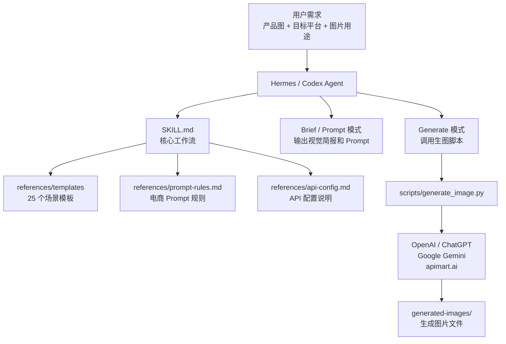
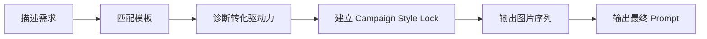
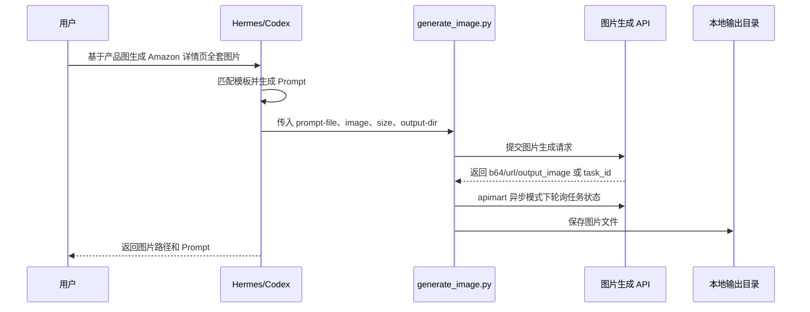
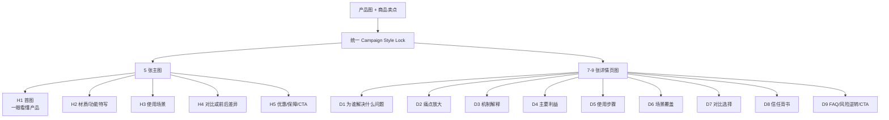
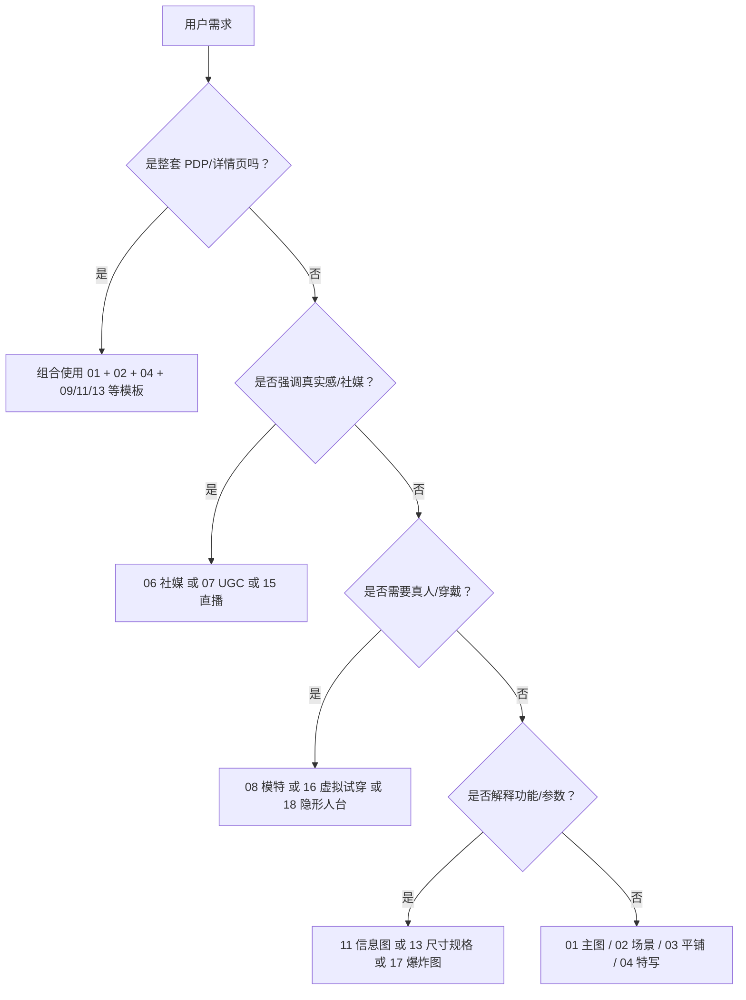

# ecom-details-image 使用指南

`ecom-details-image` 是一个面向电商视觉生产的 Hermes/Codex Skill。它可以帮助你把一张产品图和一句需求，整理成完整的电商视觉方案、可执行生图 Prompt，并在配置图片生成 API 后直接调用脚本出图。

当前脚本明确支持三类提供方：

- `openai`：OpenAI / ChatGPT 图片 API。
- `gemini`：Google Gemini 图片生成。
- `apimart`：apimart.ai 异步轮询兼容。

适合场景：

- 商品主图、白底图、纯色底产品图
- Amazon / Shopify / TikTok Shop / 淘宝详情页图片包
- 社媒推广图、小红书/Instagram/TikTok/X 内容图
- UGC 买家秀、直播间截图风格、模特展示
- 产品细节图、材质特写、包装图、信息图、尺寸图
- Campaign 组图，需要统一色板、字体、背景、光线和布局

## 目录

- [整体架构](#整体架构)
- [工作模式](#工作模式)
- [安装方式](#安装方式)
- [API 配置](#api-配置)
- [如何选择 OpenAI / Gemini](#如何选择-openai--gemini)
- [快速开始](#快速开始)
- [常见使用示例](#常见使用示例)
- [完整详情页图片包](#完整详情页图片包)
- [Campaign Style Lock](#campaign-style-lock)
- [双语提示词输出](#双语提示词输出)
- [25 个模板如何选择](#25-个模板如何选择)
- [直接运行脚本](#直接运行脚本)
- [输出文件建议](#输出文件建议)
- [安全与合规](#安全与合规)
- [排障指南](#排障指南)
- [维护者说明](#维护者说明)

## 整体架构

这个 Skill 由三层组成：

1. `SKILL.md`：给 agent 使用的核心流程说明。
2. `references/`：按需读取的 Prompt 规则、API 配置说明、25 个模板。
3. `scripts/generate_image.py`：真正调用图片生成 API 的 Python 脚本。



仓库内关键文件：

```text
skills/ecom-details-image/
├── SKILL.md                         # Agent 读取的主流程
├── README.md                        # 你正在看的用户文档
├── .env.example                     # API 配置模板，不要写真实 key
├── agents/
│   └── openai.yaml                  # Codex 类界面元数据
├── references/
│   ├── api-config.md                # API 配置和脚本参数说明
│   ├── prompt-rules.md              # 电商 Prompt 规则
│   ├── upstream.md                  # 上游来源说明
│   └── templates/                   # 25 个电商图片场景模板
└── scripts/
    └── generate_image.py            # 零第三方依赖的图片生成脚本
```

## 工作模式

这个 Skill 有两种主要用法。

### 1. Brief / Prompt 模式

不需要配置 API。Agent 会输出：

- 视觉简报
- 转化驱动力诊断
- Campaign Style Lock
- 图片序列规划
- 每张图的中文提示词
- 每张图的英文 Prompt
- 负面约束
- 关键假设

适合你想先看方案、人工复制 Prompt 到其他生图工具、或者暂时没有 API Key 的情况。



### 2. Generate 模式

需要配置 API。Agent 会先写 Prompt，再调用脚本出图：



## 安装方式

### Hermes 安装

```bash
hermes skills tap add https://github.com/liunina/hermes-skills
hermes skills install ecom-details-image
```

验证：

```bash
hermes skills list | grep ecom-details-image
```

查看 Skill：

```text
/skill ecom-details-image
```

### Codex 本地使用

如果你想在 Codex 中直接使用这个 Skill，可以把目录复制到用户级 skill 目录：

```bash
mkdir -p ~/.agents/skills
cp -R skills/ecom-details-image ~/.agents/skills/
```

或者只给当前仓库使用：

```bash
mkdir -p .agents/skills
cp -R skills/ecom-details-image .agents/skills/
```

复制后新开一个 Codex 会话，或重启 Codex。如果自动触发不明显，可以显式写：

```text
使用 $ecom-details-image 帮我为这款产品生成 Amazon 详情页图片 Prompt。
```

## API 配置

如果只输出 Prompt，不需要配置 API。

如果要直接生成图片，需要创建 `.env`。推荐把 `.env` 放在运行脚本的目录，或用 `--env-file` 指定。

```bash
cd skills/ecom-details-image
cp .env.example .env
```

编辑 `.env`。推荐显式写明 `IMG_PROVIDER`，不要只靠自动判断。

### 方案 A：OpenAI / ChatGPT

适合标准商品主图、详情页图、参考产品图生图，以及希望使用 OpenAI 官方图片 API 的场景。

```dotenv
IMG_PROVIDER=openai
IMG_BASE_URL=https://api.openai.com/v1
IMG_MODEL=gpt-image-2
IMG_API_KEY=your-openai-api-key
```

### 方案 B：Google Gemini

适合已有 Google API Key、想使用 Gemini 图像能力，或想与 OpenAI 出图风格对比的场景。

```dotenv
IMG_PROVIDER=gemini
IMG_BASE_URL=https://generativelanguage.googleapis.com/v1beta
IMG_MODEL=gemini-3.1-flash-image
GEMINI_API_KEY=your-gemini-api-key
```

### 方案 C：apimart.ai

保留给已有 apimart.ai 工作流的用户。

```dotenv
IMG_PROVIDER=apimart
IMG_BASE_URL=https://api.apimart.ai/v1
IMG_MODEL=gpt-image-2
IMG_API_KEY=your-apimart-api-key
IMG_API_MODE=async
```

### 变量说明

| 变量 | 说明 |
|---|---|
| `IMG_PROVIDER` | 图片提供方：`openai`、`gemini`、`apimart` |
| `IMG_BASE_URL` | API 根地址，不填时按 provider 使用默认地址 |
| `IMG_MODEL` | 图片模型名，不填时按 provider 使用默认模型 |
| `IMG_API_KEY` | OpenAI/apimart 通用 API Key，也可给 Gemini 使用 |
| `GEMINI_API_KEY` | Gemini 推荐 API Key 变量 |
| `IMG_API_MODE` | 仅 apimart 兼容模式使用，`sync` 或 `async` |

兼容别名：

| 标准用途 | 兼容别名 |
|---|---|
| OpenAI Key | `OPENAI_API_KEY`, `API_KEY` |
| Gemini Key | `GEMINI_API_KEY`, `GOOGLE_API_KEY`, `GOOGLE_GENAI_API_KEY`, `IMG_API_KEY`, `API_KEY` |
| 模型名 | `OPENAI_IMAGE_MODEL`, `IMAGE_MODEL`, `OPENAI_MODEL`, `GEMINI_MODEL` |
| API 根地址 | `OPENAI_BASE_URL`, `OPENAI_API_BASE`, `BASE_URL`, `GEMINI_BASE_URL` |

自动判断规则：

- `IMG_BASE_URL` 包含 `googleapis` 或 `generativelanguage`，使用 `gemini`。
- `IMG_BASE_URL` 包含 `apimart`，使用 `apimart`。
- 只有 Gemini Key 且没有 OpenAI Key，使用 `gemini`。
- 其他情况默认使用 `openai`。

不要把真实 `.env` 提交到仓库。

## 如何选择 OpenAI / Gemini

| 需求 | 推荐 |
|---|---|
| 标准商品主图、白底图、参考图保真 | 优先 OpenAI / ChatGPT |
| 已有 Google API Key 或想测试 Gemini 风格 | Gemini |
| 需要对比两套模型的转化图效果 | 同一份 Prompt 分别跑 OpenAI 和 Gemini |
| 已有 apimart 工作流 | apimart |

建议先让 Skill 输出同一套 Prompt，然后分别执行：

```bash
python3 scripts/generate_image.py --provider openai --prompt-file prompts/H1-hero.txt
python3 scripts/generate_image.py --provider gemini --prompt-file prompts/H1-hero.txt
```

再用实际点击率、转化率或人工评审决定哪套风格更适合商品。

## 快速开始

### 只生成 Prompt

在 Hermes / Codex 中输入：

```text
使用 ecom-details-image，基于我的便携咖啡杯产品，生成一张 Amazon 主图 Prompt。要求白底、产品显大、突出防漏和保温。
```

你会得到类似内容：

- 目标平台：Amazon
- 图片类型：白底主图
- 转化驱动力：痛点驱动 + 信任证明
- 色板和构图建议
- 中文提示词
- 英文 Prompt
- 负面约束

### 基于产品图生成一组社媒图

```text
使用 ecom-details-image，基于 data/cup.jpg 生成 3 张小红书风格推广图。要真实手机拍摄感，适合办公室和通勤场景。
```

### 直接出图

前提：已经配置 `.env`。

```text
使用 ecom-details-image，基于 data/cup.jpg 直接生成 3 张社媒推广图，输出到 generated-images/cup-social。
```

Agent 会生成 Prompt 文件，并调用：

```bash
python3 scripts/generate_image.py \
  --provider openai \
  --prompt-file prompt.txt \
  --image data/cup.jpg \
  --output-dir generated-images/cup-social \
  --size 4:5 \
  --resolution 2k
```

## 常见使用示例

### 商品白底主图

```text
使用 ecom-details-image，为这款无线充电器生成 Amazon 白底主图 Prompt。产品占画面 38%，背景纯白 #FFFFFF，不要文字，不要手，不要多余道具。
```

推荐模板：`01-hero-image.json`

### 生活方式场景图

```text
使用 ecom-details-image，基于这款香薰机，生成一张卧室夜间场景图。氛围要安静、高级、暖光，适合 Shopify 商品页。
```

推荐模板：`02-lifestyle-scene.json`

### 详情页信息图

```text
使用 ecom-details-image，为这款电动牙刷生成详情页信息图，展示 4 个核心卖点：长续航、防水、声波清洁、旅行便携。需要中文图中文字。
```

推荐模板：`11-infographic.json`

### UGC 买家秀

```text
使用 ecom-details-image，为这款护手霜生成 3 张 UGC 买家秀图，像 iPhone 15 Pro 随手拍，不要专业棚拍感，要有真实浴室台面和轻微噪点。
```

推荐模板：`07-ugc-style.json`

### 直播间场景

```text
使用 ecom-details-image，基于这款家用筋膜枪，生成抖音直播间带货场景图，画面里有产品展示台、促销价签和主播手势，但不要真实品牌 logo。
```

推荐模板：`15-livestream.json`

### 虚拟试穿

```text
使用 ecom-details-image，基于这款女式丝绸衬衫产品图，生成模特上身效果图。要求自然垂坠、能看出面料光泽，适合商品详情页。
```

推荐模板：`16-try-on-virtual.json` 或 `08-model-showcase.json`

## 完整详情页图片包

当你说“详情页”“PDP”“Amazon A+”“Shopify 商品页”“整套商品图”时，Skill 默认会规划一整套图片：



示例请求：

```text
使用 ecom-details-image，基于 data/shirt.jpg 这款男士白衬衫，生成 Amazon PDP 全套图片 Prompt。目标人群是商务通勤男性，核心卖点是免烫、透气、版型挺括。
```

输出建议：

- `prompts/H1-hero.txt`
- `prompts/H2-detail.txt`
- `prompts/H3-lifestyle.txt`
- `prompts/H4-comparison.txt`
- `prompts/H5-trust-cta.txt`
- `prompts/D1-intro.txt` 到 `prompts/D9-faq-cta.txt`
- `generated-images/<product-name>/` 保存图片

## Campaign Style Lock

Campaign Style Lock 是多图一致性的核心。它像一份视觉合同，要求每张图使用同一套色板、光线、字体、背景、图标和产品呈现规则。

如果没有这个机制，AI 很容易每张图都换风格：第一张是极简白底，第二张是暖色家居，第三张是霓虹科技，整套详情页就会割裂。

一个可用的 Style Lock 示例：

```text
Campaign Style Lock:
premium clean ecommerce style;
palette: #FFFFFF background, #2D2D2D text, #D4AF37 accent;
neutral 5500K studio lighting;
modern geometric sans-serif typography;
clean light gray studio background for secondary modules;
soft shadow below product;
45%+ whitespace;
thin-line icons in #2D2D2D;
product angle stays front 15-degree perspective;
do not change color palette, mix fonts, use random backgrounds, or add mismatched icon styles.
```

Prompt 生成时要把这段原样放进每一张图。中文提示词和英文 Prompt 都必须使用同一段 Style Lock，不能让两种语言版本出现视觉漂移。

## 双语提示词输出

默认情况下，每张图都会输出两版提示词：

- **中文提示词**：方便你快速理解、复核和修改，也可以复制到中文生图工具。
- **英文 Prompt**：默认用于脚本直接出图，更适合 OpenAI / ChatGPT、Gemini 和多数英文提示更稳定的图片模型。

两版提示词表达的是同一张图，不是“中文摘要 + 英文完整版”。中文版本也要包含完整的主体、场景、构图、色彩、文字、平台比例和负面约束。

推荐格式：

```markdown
### H1 主图

用途：首图，一眼看懂产品和核心卖点。

中文提示词：
在 #FFFFFF 纯白背景中展示产品，产品占画面约 38%，正面 15 度轻微透视，底部柔和阴影，至少 45% 留白。突出防漏和保温卖点，不添加文字、手、道具、水印或假 logo。

English Prompt:
Create a clean ecommerce hero image on a #FFFFFF pure white background. The product occupies about 38% of the frame, shown in a front 15-degree perspective with a soft shadow below it and at least 45% whitespace. Emphasize leak-proof and heat-retention benefits. Do not add text, hands, props, watermark, or fake logos.

负面约束：
不要添加水印、假 logo、额外产品、随机道具、杂乱背景、畸形文字或与参考图不一致的产品颜色。
```

如果你明确只想要一种语言，可以在需求里写：

```text
只输出中文提示词。
```

或：

```text
只输出英文 Prompt。
```

## 25 个模板如何选择

| 编号 | 模板 | 适合场景 |
|---|---|---|
| 01 | 商品主图 | 白底图、纯色底图、Amazon 首图 |
| 02 | 生活方式 | 家居、户外、办公室、真实使用场景 |
| 03 | 平铺摆拍 | 服装、美妆、饰品、套装俯拍 |
| 04 | 细节微距 | 材质、纹理、工艺、接口、面料 |
| 05 | 海报 Banner | 促销图、活动图、首页 banner |
| 06 | 社媒内容 | Instagram、小红书、TikTok、X |
| 07 | UGC 风格 | 买家秀、真实晒单、手机随拍 |
| 08 | 模特展示 | 服装上身、配饰佩戴、真人展示 |
| 09 | 前后对比 | 护肤、清洁、健身、效率提升 |
| 10 | 包装设计 | 礼盒、开箱、包装质感 |
| 11 | 信息图 | A+ Content、详情页卖点图 |
| 12 | 创意概念 | 品牌大片、艺术化广告 |
| 13 | 尺寸规格 | 尺码、参数、步骤说明 |
| 14 | 多品组合 | 套装、组合、SKU 展示 |
| 15 | 直播间 | 直播带货、促销场景 |
| 16 | 虚拟试穿 | 服饰、鞋包、融入真实场景 |
| 17 | 爆炸图 | 结构拆解、组件说明 |
| 18 | 隐形人台 | 服装立体展示 |
| 19 | 多角度网格 | 360 度、多角度、多色图 |
| 20 | 杂志编辑 | 高级时尚、封面、编辑部风格 |
| 21 | 季节 Campaign | 节日、四季、主题活动 |
| 22 | 轻奢氛围 | 高端美妆、香水、珠宝、精品 |
| 23 | 设备样机 | App、SaaS、网站、数码屏幕 |
| 24 | 店铺陈列 | 门店、货架、展柜、快闪店 |
| 25 | 运动 Campaign | 健身、户外、运动品牌 |

选择逻辑：



## 直接运行脚本

脚本只依赖 Python 标准库，不需要 `pip install`。

查看帮助：

```bash
python3 skills/ecom-details-image/scripts/generate_image.py --help
```

直接传 Prompt：

```bash
cd skills/ecom-details-image

python3 scripts/generate_image.py \
  --provider openai \
  --prompt "clean product hero image, #FFFFFF background, product occupies 38% of frame, at least 45% whitespace, no watermark, no fake logo" \
  --size 1:1 \
  --resolution 2k
```

从文件读取 Prompt：

```bash
python3 scripts/generate_image.py \
  --provider gemini \
  --prompt-file prompts/H1-hero.txt \
  --output-dir generated-images/my-product \
  --size 1:1 \
  --resolution 2k
```

带产品参考图：

```bash
python3 scripts/generate_image.py \
  --provider openai \
  --prompt-file prompts/D1-intro.txt \
  --image data/product.jpg \
  --output-dir generated-images/my-product \
  --size 4:5 \
  --resolution 2k
```

指定 `.env`：

```bash
python3 scripts/generate_image.py \
  --env-file /absolute/path/to/.env \
  --provider gemini \
  --prompt-file prompts/social-01.txt \
  --size 4:5
```

常用参数：

| 参数 | 说明 |
|---|---|
| `--provider` | 图片提供方：`openai`、`gemini`、`apimart` |
| `--prompt` | 直接传入 Prompt |
| `--prompt-file` | 从文本文件读取 Prompt |
| `--image` | 参考产品图 |
| `--output-dir` | 图片输出目录，默认 `generated-images` |
| `--size` | 图片比例或尺寸，默认 `1:1` |
| `--resolution` | 目标清晰度，`1k` / `2k` / `4k` |
| `--quality` | OpenAI/兼容接口质量参数 |
| `--n` | OpenAI/兼容同步模式生成数量 |
| `--format` | 输出扩展名，`png` / `jpeg` / `webp` |
| `--mode` | 仅 apimart 兼容模式使用，`sync` 或 `async` |
| `--poll-interval` | apimart 异步轮询间隔 |
| `--timeout` | apimart 异步轮询超时 |

## 输出文件建议

推荐按产品或任务分目录，便于复盘和 A/B 测试：

```text
generated-images/
└── silk-shirt-amazon-pdp/
    ├── prompts/
    │   ├── H1-hero.txt
    │   ├── H2-detail.txt
    │   ├── H3-lifestyle.txt
    │   └── D1-intro.txt
    ├── H1-hero.png
    ├── H2-detail.png
    ├── H3-lifestyle.png
    └── D1-intro.png
```

版本管理建议：

- Prompt 可以提交，方便复用和迭代。
- 生成图片通常不要提交，除非是精选案例或文档示例。
- 真实产品原图如果涉及客户/商家资产，不要公开提交。
- `.env` 永远不要提交。

## 安全与合规

使用这个 Skill 时注意：

- 不要在聊天、README、脚本、提交记录里写真实 API Key。
- 不要让图片生成虚假的认证标志、平台背书、品牌 logo 或检测报告。
- 医疗、美妆、保健、食品类商品不要写无法证明的功效承诺。
- 如果产品外观必须高度准确，尽量传入参考产品图。
- 如果是服装试穿、真人展示，注意肖像权和模特素材来源。
- 上游 `liangdabiao/ecom-details-image` 在导入时未声明 License，正式再分发前应确认授权。

## 排障指南

### 只想要 Prompt，但 Agent 尝试调用脚本

明确写：

```text
只输出 Prompt，不要调用生图脚本。
```

### 提示缺少 API Key

说明脚本没有找到对应 provider 的密钥。处理方式：

```bash
cd skills/ecom-details-image
cp .env.example .env
```

然后填写：

```dotenv
IMG_BASE_URL=...
IMG_MODEL=...
IMG_API_KEY=...
```

如果使用 Gemini，也可以写：

```dotenv
IMG_PROVIDER=gemini
GEMINI_API_KEY=...
```

或者运行时指定：

```bash
python3 scripts/generate_image.py --env-file /path/to/.env --prompt-file prompt.txt
```

### apimart 异步任务一直没有完成

可以加大超时时间：

```bash
python3 scripts/generate_image.py \
  --prompt-file prompt.txt \
  --timeout 300 \
  --poll-interval 8
```

同时检查 API 服务商后台是否有任务失败、额度不足或模型不可用。

### Gemini 返回中没有图片

检查：

- 是否设置了 `IMG_PROVIDER=gemini` 或命令行 `--provider gemini`。
- 是否使用了有效的 `GEMINI_API_KEY`。
- Prompt 是否明确要求“生成图片”，而不是只描述分析任务。
- 如果用了参考图，图片格式是否为 png/jpg/jpeg/webp/gif。

### 生成图中文字不准确

建议：

- 减少图中文字数量。
- 中文文案用 `「」` 包起来。
- 避免复杂字和长句。
- 一张图只放一个主标题、2-3 个短标签和一个 CTA。
- 关键文字可以后期用设计工具叠加。

### 产品不像原图

建议：

- 使用 `--image product.jpg`。
- Prompt 里减少对产品外观的想象性描述。
- 明确产品颜色、材质、角度、比例。
- 不要要求 AI 同时改变产品结构和保持产品一致。

### 多张图风格不统一

检查是否每张 Prompt 都原样包含同一段 Campaign Style Lock。重点统一：

- 色板
- 背景
- 光线
- 字体
- 图标线宽
- 产品角度
- 留白比例

## 维护者说明

本 Skill 的设计原则：

- `SKILL.md` 保持 agent 可执行的核心流程，不写成长教程。
- `README.md` 面向人类用户，解释安装、配置、示例和排障。
- `references/prompt-rules.md` 放 Prompt 细则。
- `references/api-config.md` 放 API 和脚本细则。
- `references/templates/*.json` 保持结构化模板。
- `scripts/generate_image.py` 保持零第三方依赖。

本地校验：

```bash
python3 -m py_compile skills/ecom-details-image/scripts/generate_image.py
find skills/ecom-details-image/references/templates -name '*.json' -print -exec python3 -m json.tool {} \; >/dev/null
```

Codex Skill 校验：

```bash
python3 ~/.codex/skills/.system/skill-creator/scripts/quick_validate.py skills/ecom-details-image
```

发布前检查：

- README 中不能出现真实 API Key。
- `.env` 不能入库。
- 不要提交大批生成图片。
- 如果更新了脚本参数，要同步更新 `references/api-config.md` 和本 README。
- 如果更新了 Prompt 输出规则，要同步确认中文提示词和英文 Prompt 都被文档覆盖。
